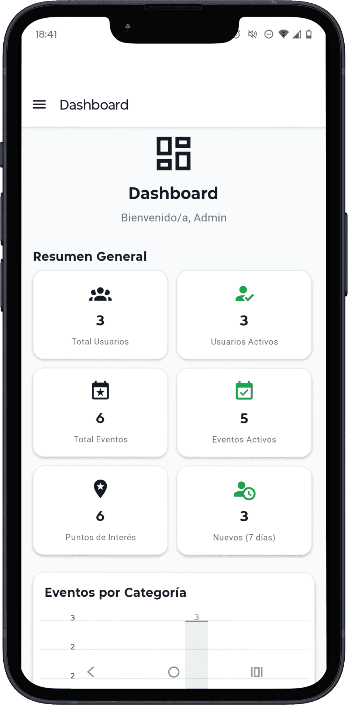
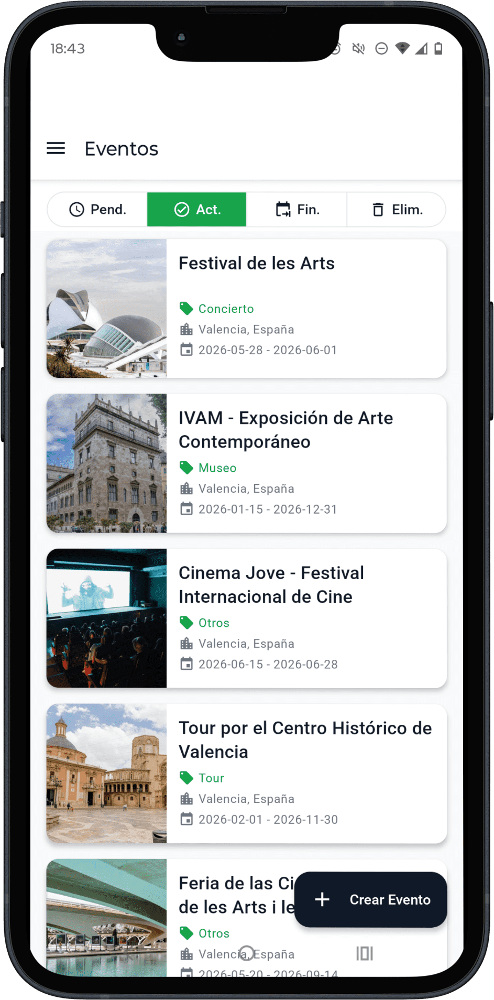
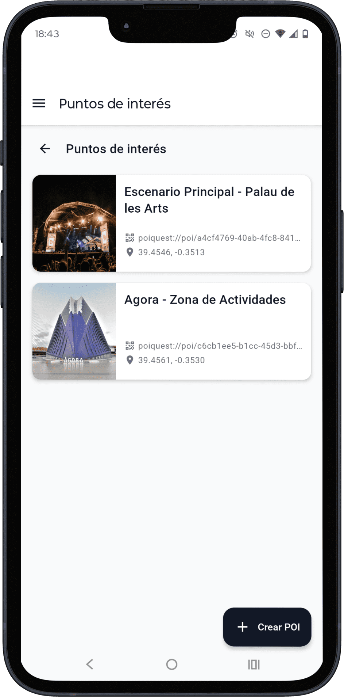
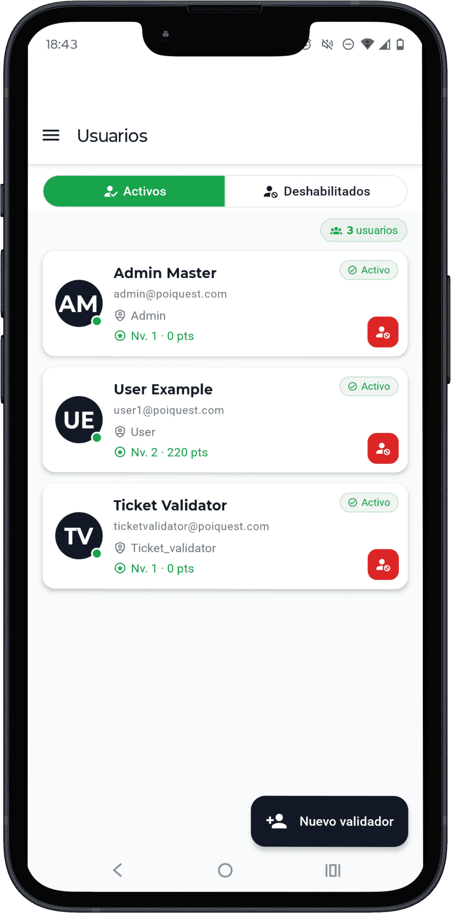

<div align="center">
  

  <h1>PoiQuest — Panel de Administración</h1>
  <p><em>Gestión centralizada de eventos culturales, POIs, rutas, partners y usuarios</em></p>

  
  
  
  
  
</div>

---

> Aplicación de administración del ecosistema **PoiQuest** desarrollada con **React Native y Expo**, preparada para **móviles y tablets**, que centraliza la gestión de eventos, POIs, rutas, partners y usuarios del sistema.

---

## Índice

1. [¿Qué hace esta app?](#qué-hace-esta-app)
2. [Capturas de pantalla](#capturas-de-pantalla)
3. [Características principales](#características-principales)
4. [Stack tecnológico](#stack-tecnológico)
5. [Arquitectura](#arquitectura)
6. [Estructura del proyecto](#estructura-del-proyecto)
7. [Instalación y puesta en marcha](#instalación-y-puesta-en-marcha)
8. [Variables de entorno](#variables-de-entorno)
9. [Pantallas principales](#pantallas-principales)
10. [Contribución](#contribución)
11. [Autor](#autor)
12. [Licencia](#licencia)

---

## ¿Qué hace esta app?

PoiQuest Admin convierte un móvil o tablet en el centro de operaciones del ecosistema cultural. El flujo de trabajo habitual de un administrador es:

1. **Prepara el evento** — Crea el evento con imagen, categoría y fechas. Define cada punto de interés con su posición en el mapa y su modelo 3D para realidad aumentada.
2. **Diseña la experiencia** — Construye las rutas del evento arrastrando y reordenando los POIs hasta que el recorrido tenga sentido, previsualizado en el mapa en tiempo real.
3. **Configura los accesos** — Revisa los partners vinculados al evento (organizadores, patrocinadores, ciudad) y asegúrate de que las cuentas validadoras de tickets están activas.
4. **El día del evento** — Los validadores escanean los QR de los asistentes desde la app de usuario. Desde el panel de administración se puede habilitar o deshabilitar cuentas si surge alguna incidencia.
5. **Analiza los resultados** — Accede al dashboard para consultar la evolución de registros, la distribución por categoría de eventos y las estadísticas globales del sistema.

---

## Capturas de pantalla

<div align="center">

| Dashboard | Gestión de Eventos | Gestión de POIs | Gestión de Usuarios |
|:---------:|:------------------:|:---------------:|:-------------------:|
|  |  |  |  |

</div>

> Las capturas muestran el modo claro de la interfaz. La app soporta también modo oscuro completo.
---

## Características principales

- **Renovación automática de JWT** — Interceptor Axios detecta el 401, renueva el access token con el refresh token almacenado en `expo-secure-store` y reintenta la petición original sin intervención del usuario.
- **Modo claro/oscuro persistido** — Tema Material Design 3 personalizado gestionado en `useThemeStore` (Zustand) y aplicado globalmente via `ThemeProvider` en tiempo real.
- **Paginación por cursor** — Los listados de entidades usan paginación por cursor en lugar de offset, evitando duplicados y siendo más eficientes con conjuntos de datos grandes.
- **Subida de archivos en dos modalidades** — Imágenes de portada via `expo-image-picker` y modelos 3D GLB para realidad aumentada via `expo-document-picker`, con previsualización previa al envío.
- **Drag & drop nativo para ordenación** — `react-native-draggable-flatlist` permite reordenar los POIs de una ruta visualmente sin formularios auxiliares.
- **Validación en dos capas** — React Hook Form gestiona el estado del formulario y Zod valida el esquema de datos; los errores se muestran en tiempo real por campo.
- **AR sin dependencia nativa** — El visor de modelos 3D (`model-viewer`) corre dentro de una WebView, eliminando la necesidad de módulos nativos adicionales y manteniendo compatibilidad multiplataforma.
- **Resolución automática de API por entorno** — `constants.ts` detecta si la app corre en emulador Android (`10.0.2.2`), iOS Simulator (`localhost`) o dispositivo físico real (`EXPO_PUBLIC_API_URL`), sin cambios manuales entre entornos.

---

## Stack tecnológico

| Categoría | Tecnología | Versión |
|-----------|-----------|---------|
| Framework | React Native + Expo | 0.81.5 / ~54 |
| Lenguaje | TypeScript | ~5.9 |
| Navegación | Expo Router + Drawer Navigator | ~6.0 / ^7.7 |
| Estado servidor | TanStack React Query | ^5.90 |
| Estado global | Zustand | ^5.0 |
| Formularios | React Hook Form + Zod | ^7.71 / 3.23 |
| UI | React Native Paper (MD3) | ^5.14 |
| HTTP | Axios | ^1.13 |
| Mapas | MapTiler vía WebView | — |
| Gráficos | react-native-chart-kit | ^6.12 |
| Animaciones | Moti + Reanimated | ^0.30 / ~4.1 |
| Almacenamiento seguro | expo-secure-store | ~15.0 |
| Arquitectura RN | New Architecture | ✓ |

---

## Arquitectura

La aplicación emplea una **arquitectura por tipo de archivo** donde cada carpeta tiene una única responsabilidad bien definida. Cada capa es independiente: los `hooks/queries/` acceden a los `services/`, los `components/` consumen los hooks, y los `stores/` de Zustand gestionan el estado global sin acoplar las pantallas entre sí.

---

## Estructura del proyecto

```
src/
├── app/                      # Pantallas — Expo Router (file-based routing)
│   ├── _layout.tsx            # Layout raíz: providers globales + SnackbarRoot
│   ├── login.tsx              # Acceso de administrador
│   └── (protected)/
│       ├── _layout.tsx        # Guard de autenticación — Redirect si no autenticado
│       ├── preferences.tsx    # Toggle de tema claro/oscuro
│       └── (drawer)/          # Navegación lateral (CustomDrawerContent)
│           ├── index.tsx      # Dashboard con analytics
│           ├── events/        # CRUD de eventos
│           ├── pois/          # CRUD de POIs por evento
│           ├── routes/        # CRUD de rutas por evento
│           ├── partners/      # Ciudades, organizadores y patrocinadores
│           └── users/         # Usuarios y validadores
│
├── components/                # Componentes reutilizables por módulo
│   ├── common/                # ButtonApp, TextInputApp, ChipFilterApp,
│   │                          # SegmentedButtonGroupApp, SnackbarApp, StatusBadgeApp…
│   ├── analytics/             # OverviewStatsCard, EventsByCategoryChart,
│   │                          # UsersByMonthChart
│   ├── events/                # EventCardApp, EventForm
│   ├── pois/                  # PoiCardApp, PoiForm, PoiMapViewer, PoiMapPicker,
│   │                          # ARViewerModal, QRCodeModal
│   ├── routes/                # RouteCardApp, RouteForm, RouteMap
│   ├── partners/              # CityCardApp, OrganizerCardApp, SponsorCardApp + Forms
│   └── users/                 # UserCardApp, UserForm
│
├── hooks/queries/             # Hooks de React Query por módulo
├── services/                  # api.client.ts (Axios + JWT interceptor) + servicio/módulo
├── stores/                    # Zustand: useUserStore, useThemeStore, useSnackbarStore
├── schemas/                   # Esquemas de validación Zod por módulo
├── providers/                 # AuthProvider, QueryProvider, ThemeProvider
├── styles/                    # StyleSheet por pantalla (desacoplados del JSX)
├── types/                     # Modelos TypeScript compartidos entre capas
├── constants.ts               # API_BASE_URL + endpoints (auto-resolved para emuladores)
└── theme.ts                   # Tema Material Design 3 personalizado
```

---

## Pantallas principales

### 🏠 Dashboard
Vista de inicio con métricas globales del sistema: tarjeta de estadísticas generales (`OverviewStatsCard`), gráfico de barras de eventos por categoría y gráfico de líneas de registros de usuarios por mes.

### 📅 Gestión de Eventos
Lista paginada con cursor de todos los eventos, incluyendo un filtro para ver eventos eliminados con soft-delete. CRUD completo con `EventForm`: subida de imágenes via `expo-image-picker`, selección de categoría, fechas con `react-native-paper-dates` y validación Zod.

### 📍 Gestión de POIs
CRUD completo de POIs organizados por evento. Cada POI gestiona: posición en mapa interactivo con `PoiMapPicker` (MapTiler), imagen de portada, modelo 3D GLB para AR via `expo-document-picker`, QR de verificación visible en `QRCodeModal` y previsualización AR en `ARViewerModal` (WebView + `model-viewer`).

### 🗺️ Gestión de Rutas
CRUD completo de rutas asociadas a cada evento con sus POIs ordenados. El formulario incluye `react-native-draggable-flatlist` para reordenar visualmente los puntos de interés y una previsualización de la ruta resultante sobre `RouteMap` (MapTiler).

### 🤝 Gestión de Partners
Panel unificado con selector de pestañas entre **Ciudades**, **Organizadores** y **Patrocinadores**. Cada entidad permite crear, listar con tarjeta, editar con subida de logo y desactivar desde su pantalla de detalle.

### 👥 Gestión de Usuarios
Listado de usuarios con filtro activos/deshabilitados mediante `SegmentedButtonGroupApp`. Permite crear nuevas cuentas de validador de tickets (`UserForm`) y activar o deshabilitar cuentas directamente desde `UserCardApp`.

### ⚙️ Preferencias
Toggle de tema claro/oscuro persistido en `useThemeStore` y aplicado globalmente a través de `ThemeProvider`.

---

## Variables de entorno

Copia `.env.example` a `.env` y rellena los valores:

```env
# Clave API de MapTiler — mapas en POIs y rutas (https://www.maptiler.com/)
EXPO_PUBLIC_MAPTILER_KEY=your_maptiler_api_key_here

# URL del backend — solo necesaria en dispositivo físico real
# En emuladores se resuelve automáticamente:
#   Android Studio → 10.0.2.2:8000
#   iOS Simulator  → localhost:8000
EXPO_PUBLIC_API_URL=http://<TU_IP_LOCAL>:8000
```

---

## Instalación y puesta en marcha

### Prerrequisitos

- Node.js ≥ 20
- Backend PoiQuest corriendo — ver [poiquest_backend_nestjs](https://github.com/alexMartJu/PoiQuest_backend_nestjs)
- Cuenta en [MapTiler](https://www.maptiler.com/) para la clave API de mapas
- **Expo Go** instalado en el dispositivo (o Android Studio / Xcode para emuladores)

### Pasos

```bash
# 1. Clona el repositorio
git clone https://github.com/alexMartJu/poiquest_frontend_admin_reactnative.git
cd poiquest_frontend_admin_reactnative

# 2. Instala las dependencias
npm install

# 3. Configura las variables de entorno
cp .env.example .env
# Edita .env: añade EXPO_PUBLIC_MAPTILER_KEY
# Añade EXPO_PUBLIC_API_URL solo si usas dispositivo físico real

# 4. Arranca el servidor de Expo
npx expo start
```

Tras ejecutar `npx expo start`, escanea el código QR con **Expo Go** en tu dispositivo, o pulsa `a` para abrir directamente en el emulador Android.

---

## Contribución

1. Haz un fork del repositorio y crea tu rama: `git checkout -b feature/mi-mejora`
2. Verifica el análisis estático sin errores: `npx tsc --noEmit`
3. Comprueba el linting: `npx expo lint`
4. Haz commit con mensaje descriptivo: `git commit -m "feat: descripción de la mejora"`
5. Abre una Pull Request detallando los cambios y el contexto

---

## Autor

**Alex Martinez Juan** · [@alexMartJu](https://github.com/alexMartJu)

---

## Licencia

Este proyecto está publicado bajo la [Licencia MIT](LICENSE).
